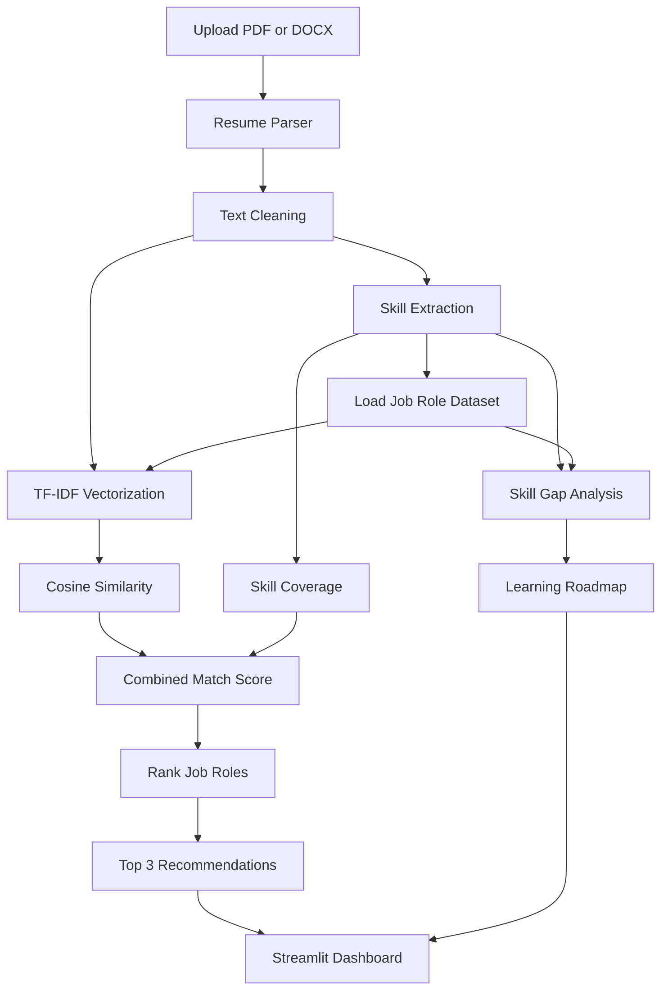

# System workflow

```mermaid
flowchart TD
    A[Upload PDF or DOCX] --> B[Resume Parser]
    B --> C[Text Cleaning]
    C --> D[Skill Extraction]
    D --> E[Load Job Role Dataset]
    C --> F[TF-IDF Vectorization]
    E --> F
    F --> G[Cosine Similarity]
    D --> H[Skill Coverage]
    G --> I[Combined Match Score]
    H --> I
    I --> J[Rank Job Roles]
    J --> K[Top 3 Recommendations]
    D --> L[Skill Gap Analysis]
    E --> L
    L --> M[Learning Roadmap]
    K --> N[Streamlit Dashboard]
    M --> N
```
